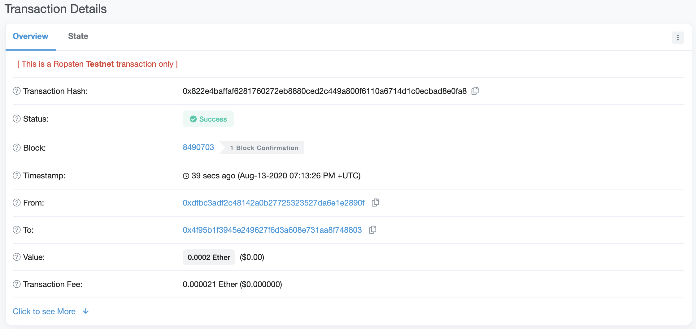

# Local Wallet Generator for BTC-Testnet & ETH-Testnet

This project generates accounts for both Bitcoin and Ethereum from private keys, that can then be used to transact with.

## Prerequisites

The installation of the pip dependencies "bit" and "web3" are as follows:

```
$ pip install bit
```

That command will install bit to be used with python. Use the following command to confirm installation, as well as finding out which version of bit was installed:

```
$ pip list | grep bit
```

To install web3, the command is as follows:

```
$ pip install web3
```

Similar to the bit library, that command will install web3 to be used with python. To confirm the installation, as well as checking the installed version, enter as follows:

```
$ pip list | grep web3
```

To clone and install the hd-wallet derive, enter the following:

```
$ git clone https://github.com/dan-da/hd-wallet-derive
$ cd hd-wallet-derive
$ php -r "readfile('https://getcomposer.org/installer');" | php
$ php composer.phar install
```

Lastly, you need to create a symlink called "derive" for the hd-wallet-derive/hd-wallet-derive.php script into the top level project directory like so: 

```
$ ln -s hd-wallet-derive/hd-wallet-derive.php derive
```

## Running the tests

### Bitcoin

You simply run the wallet/wallet.py file from the command line using python.

```
$ python wallet.py
```

Lines 177 and 183 run the actual transactions, comment out 177 if you want to run a ETH transaction. Comment out 183 if you want to run a BTC transaction.

Lastly, after creating the address, I funded a BTC and ETH address testnet crypto.

For BTC, use [this](https://coinfaucet.eu/en/btc-testnet/).

For ETH, use [this](https://faucet.ropsten.be/).

### Break down into end to end tests

Below is an image of a valie BTC-testnet transaction. It can be found on Blockchain [here](https://www.blockchain.com/btc-testnet/tx/e48b3871afed3e0fcdd6118cb9fe2a9b02236affb91c7bf1dbe1ef5075561cd7).


The code to run the transaction above is as follows:

```
send_tx(BTCTEST, btc_accounts["account_01"], btc_accounts["account_02"], 0.00000003)
```

(The code in that above instance could be altered to have transactions occur with different accounts. for example "account_02" and "account_03". Granted, they would also need to be funded.)

To achieve this, you would run:

```
$ python wallet.py
```

An example output is shown here:


The output is the transaction hash that can then be searched on Blockchain for the Bitcoin testnet, as previously demonstrated.

### Ethereum

Below is an image of a valid ETH-testnet transaction.
It can be found on Etherescan [here](https://ropsten.etherscan.io/tx/0x822e4baffaf6281760272eb8880ced2c449a800f6110a6714d1c0ecbad8e0fa8).



The code to run the transaction above is as follows:

```
send_tx(ETH, eth_accounts["account_01"], eth_accounts["account_02"], 200000000000000)
```

(The code in that above instance could be altered to have transactions occur with different accounts. for example "account_02" and "account_03". Granted, they would also need to be funded.)

To achieve this, you would run:

```
$ python wallet.py
```

An example output is shown here:


The output is the transaction hash that can then be searched on Etherscan for the Ropsten testnet, as previously demonstrated.

## Built With

* [python](https://www.python.org/) - Programming language.
* [hd-wallet-derive](https://github.com/dan-da/hd-wallet-derive) - CLI tool that derives bip32 addresses and private keys.
* [Bit](https://ofek.dev/bit/) - Python Bitcoin library.
* [web3.py](https://github.com/ethereum/web3.py) - Python Ethereum library.
* [Infura](https://infura.io/) - API used to access the Ethereum and IPFS networks.
* [subprocess](https://docs.python.org/3/library/subprocess.html) - Module that allows you to spawn new processes, connect to their input/output/error pipes, and obtain their return codes.

## Authors

* **Roberto Cantu**  - [GitHub](https://github.com/RCantu92)